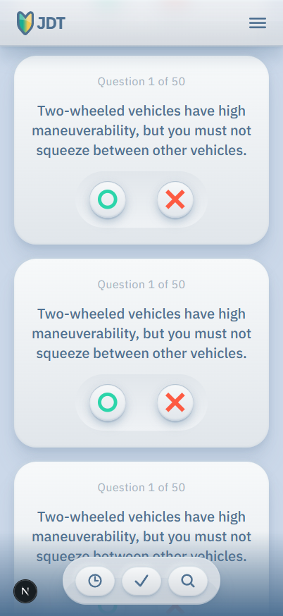

# Japan Driving Test

_Driving Test App designed to help people living in Japan pass their written driving tests._



## 🚀 Live Demo

[View Live Site](https://jdt.vercel.app/) | [GitHub Repository](https://github.com/GaryWintle/jdt.git)

## 📋 Overview

This project is specifically made to help people who are living in Japan practice for their written driving exam. When I studied for my exams, using the huge outdated sheets of paper provided were a hassle, so I thought making this would help people out.

**Key Features:**

- 🎨 Beautiful, responsive design with Tailwind CSS
- ⚡ Fast performance with Next.js optimization
- 📱 Mobile-first responsive design
- 🔒 Secure and accessible

## 🛠️ Built With

- **Frontend:** Next.js 14, React, TypeScript
- **Styling:** Tailwind CSS
- **Deployment:** Vercel
- **Tools:** ESLint, Prettier

## 🎯 What I Learned

- How to implement server-side rendering with Next.js
- Advanced Tailwind CSS techniques for responsive design
- Component architecture and reusable design patterns
- Performance optimization strategies
- Accessibility best practices

## 🚀 Getting Started

### Prerequisites

- Node.js 18+
- npm or yarn

### Installation

```bash
# Clone the repository
git clone https://github.com/GaryWintle/jdt.git

# Navigate to project directory
cd repo-name

# Install dependencies
npm install

# Start development server
npm run dev
```

Open [http://localhost:3000](http://localhost:3000) to view it in your browser.

## 📁 Project Structure

```
├── src/
│   ├── app/                    # Next.js App Router
│   │   ├── learners/           # Route: /learners
│   │   ├── layout.tsx          # Root layout
│   │   ├── page.tsx            # Homepage
│   │   └── globals.css         # Global styles
│   ├── components/             # Reusable UI components
│   │   ├── layout/             # Layout components
│   │   │   ├── MainHeader.tsx
│   │   │   └── TestFooterMenu.tsx
│   │   └── ui/                 # UI components
│   │       ├── QuestionCard.tsx
│   │       └── QuestionCardButton.tsx
│   ├── hooks/                  # Custom React hooks
│   └── lib/                    # Utility functions
├── public/                     # Static assets
│   ├── JDT-logo.svg
│   └── [icons & images]
├── tailwind.config.ts          # Tailwind configuration
└── package.json
```

## 🎨 Design Decisions

- **Typography:** Chose clean, modern fonts for readability
- **Color Scheme:** Implemented accessible color contrast ratios
- **Layout:** Mobile-first approach with progressive enhancement
- **Performance:** Optimized images and implemented lazy loading

## 🔧 Features in Detail

### Responsive Navigation

Clean, accessible navigation that works across all devices with smooth animations.

### Performance Optimizations

- Next.js Image component for optimized loading
- Component-level code splitting
- SEO-friendly meta tags

## 🚀 Deployment

This project is deployed on Vercel with automatic deployments from the main branch.

## 📈 Future Improvements

- [ ] Add dark mode toggle
- [ ] Kanji Driving-related Flashcard Test

## 🌝 Give me a shout!

- **Portfolio:** [wintle.dev](https://wintle.dev)
- **LinkedIn:** [My Linkedin](https://www.linkedin.com/in/gary-wintle-9168962/)

---

\_Built with ❤️ by Gary Wintle - a working artist and aspiring developer
